<!-- ──────────────────────────────────────────────────────────────── -->
<!--  Mohammad Umar · GitHub Profile README                          -->
<!--  Repo: Mohammad-umer7/Mohammad-umer7                            -->
<!-- ──────────────────────────────────────────────────────────────── -->

<div align="center">



<h3>Chief AI Officer @ Kanban Studios — I design multi-agent AI systems and ship them as real products.</h3>

<p>Agentic workflows · RAG & document intelligence · govtech decision engines · voice AI · industrial automation — built end-to-end, deployed, and auditable.</p>


<br/><br/>

<a href="https://www.linkedin.com/in/mohammad-umer-617401350/"></a>
<a href="mailto:omerjamaljn@gmail.com"></a>
<a href="https://github.com/Mohammad-umer7"></a>
<!-- Portfolio badge — uncomment and set URL when your portfolio site is live
<a href="https://YOUR_PORTFOLIO_URL"></a>
-->

<br/><br/>


<a href="https://github.com/Mohammad-umer7?tab=followers"></a>


</div>

<div align="center">

<!-- ── Quick Identity Badges ────────────────────────────────────── -->


</div>

<br/>


## 🧭 About Me

I'm a Software Engineering student in Abu Dhabi who builds AI products the whole way through — data, models, agents, backend, frontend, deployment — not just notebooks.

- 🧠 **Chief AI Officer @ Kanban Studios** — leading the AI product arm: a productized AI-service catalog, RAG & document-intelligence workflows, the **Kanban Agents** autonomous-automation infrastructure, AI-safety frameworks, and Stripe-ready SaaS.
- 🔬 **Visiting Researcher — Mixed Reality & Automation** at **BRIDGE (EDGE Group)**, working on an Industry 4.0/5.0 smart-warehouse platform: real-time HMIs, a Three.js digital twin, sensor-connected Raspberry Pis, and ML forecasting.
- 🚀 **Founder & CTO of XPBridge** — a mobile app I designed, built, and shipped solo to the **Google Play Store**.
- 🤖 My specialty is **agentic AI that can be trusted**: multi-agent pipelines with deterministic guardrails, compliance critics that can veto, fairness checks, and immutable audit logs — the boring parts done right.
- 🎓 BSc Software Engineering @ **Al Ain University** (expected 2027) — **CGPA 3.73 / 4.00**, named to the **Honor List three consecutive semesters**.
- 🏆 **7× competition podiums & honors** across UAE tech events — 2× 1st place (incl. G42's Tamkeen 5.0, Agentic AI track), 2× 2nd, 1× 3rd, plus finalist & championship recognition.
- 🌍 I work in English, Urdu, Hindi and Pashto (fluent), plus basic Arabic — and I ship bilingual EN/AR interfaces by default.

## 🛠️ What I Build

| Category | Proof of work |
|---|---|
| 🤖 **Agentic AI Systems** | 11-agent LangGraph govtech engine ([SADDAD](https://github.com/Mohammad-umer7/housing)), 7-agent finance coach ([ParentWise](https://github.com/Mohammad-umer7/finance)) |
| 📚 **RAG & Knowledge Tools** | University RAG chatbot with cited answers ([demo](https://ai-university-assistant-rag-chatbot.vercel.app/)), an assistant that can *unlearn* ([Aletheia](https://github.com/Mohammad-umer7/cognee)) |
| 🗣️ **Voice AI** | Hands-free assistant with Whisper + Gemini ([Jarvis demo](https://jarvis-ai-voice.vercel.app/)) |
| 🌐 **Full-Stack Web Apps** | Next.js + FastAPI products deployed on Vercel / Hugging Face Spaces |
| 📱 **Mobile Apps** | [XPBridge](https://play.google.com/store/apps/details?id=com.xpbridge.app) — live on Google Play (React Native + Supabase) |
| 🏭 **Industrial Automation & Digital Twins** | ASRS 2.0 smart-warehouse HMIs, Three.js digital twin, Boston Dynamics Spot programming @ EDGE Group |
| ⚡ **Hackathon Prototypes** | 7+ competition builds — fraud intelligence, worker safety, food security, real-estate compliance, bilingual STEM education |

## 🧰 Tech Toolbox

<div align="center">

**Languages**


**AI / ML**


<br/><br/>


**Frontend & Mobile**


<br/><br/>


**Backend & Data**


<br/><br/>


**Cloud · DevOps · Hardware**


<br/><br/>


**Tools & Design**


</div>

## 🎯 Current Focus

- 🧠 Building Kanban Studios' core AI capability as **Chief AI Officer** — shaping the AI service catalog, next-gen **RAG & document-intelligence** demos, the **Kanban Agents** infrastructure, AI-safety frameworks, and Stripe-ready SaaS products.
- 🏭 Advancing the **ASRS platform** and industrial-automation R&D as a Visiting Researcher at **BRIDGE (EDGE Group)** — real-time sensor connectivity, machine communication, and smart-automation systems.
- 🧠 Going deeper on **agent architectures**: LangGraph state machines, tool subgraphs, and the **Model Context Protocol** (4 Anthropic certifications, May 2026).
- 📱 Growing **XPBridge** post-launch — new AI features, retention, and store performance.
- 🎓 On track to graduate in **2027**; aiming at agentic-AI and full-stack engineering roles where systems must be **fast, bilingual, and auditable**.

## 🎓 Education & Experience

**🧠 Kanban Studios — Chief AI Officer (CAIO)** *(Jul 2026 – Present)* — leading AI strategy and engineering for the studio:

- **Productizing AI services** — a robust AI service catalog, from bespoke automation systems to intelligent business tools.
- **Next-gen AI demos** — cutting-edge **Retrieval-Augmented Generation (RAG)** models and advanced document-intelligence workflows.
- **Agentic workflows** — enhancing the **Kanban Agents** infrastructure for autonomous, high-efficiency business automation.
- **AI safety & risk mitigation** — frameworks that keep every deployed model secure, compliant, and reliable.
- **Stripe-ready SaaS** — scalable commercial software products built for global monetization.

**🔬 BRIDGE — EDGE Group PJSC** · Abu Dhabi · *10 months, 3 progressive roles*

- **Visiting Researcher — Mixed Reality & Automation** *(Jan 2026 – Present)* — ongoing R&D on the ASRS platform, real-time sensor connectivity, and industrial machine communication.
- **Intelligent Systems & Automation Trainee** *(Sep – Dec 2025)* — ASRS 2.0 smart-warehouse platform: shipped 5+ Svelte/TypeScript HMI pages (EN/AR, dark/light), wired them to 5+ FastAPI endpoints, built a unified **Three.js digital twin** with live motion logic, integrated 2 Raspberry Pis over WebSockets for safety stops, implemented **mTLS + RBAC + rate limiting**, built an **XGBoost** sales-forecasting model, and resolved 50+ bugs in weekly Agile sprints. [Full internship report →](https://drive.google.com/file/d/1g67zL4t6VNEbGoX9V0MZmingsBToJb2U/view?usp=sharing)
- **Software Engineer Intern** *(Aug – Sep 2025)* — programmed the **Boston Dynamics Spot** robot for border-patrol use cases; co-designed ASRS's 3-tier architecture from stakeholder requirements.

**🚀 XPBridge — Founder & CTO** *(Jan 2026 – Present)* — own the full stack of a published mobile product: React Native frontend, Supabase/PostgreSQL backend + auth, AI features, and the complete lifecycle through [Google Play release](https://play.google.com/store/apps/details?id=com.xpbridge.app).

**🎓 Al Ain University — BSc Software Engineering** *(expected 2027)* — CGPA **3.73/4.00**, Honors List, Abu Dhabi campus.

<details>
<summary><b>📜 Certifications (11)</b></summary>
<br/>

| Area | Certification |
|---|---|
| Machine Learning | Advanced Learning Algorithms — Stanford / DeepLearning.AI (May 2026) |
| Machine Learning | Supervised ML: Regression & Classification — Stanford Online (May 2026) |
| Agentic AI / MCP | Introduction to Model Context Protocol — Anthropic (May 2026) |
| Agentic AI / MCP | MCP: Advanced Topics — Anthropic (May 2026) |
| Agentic AI / MCP | Claude Code in Action — Anthropic (May 2026) |
| Agentic AI / MCP | Introduction to Agent Skills — Anthropic (May 2026) |
| LLMs | Prompt Engineering for ChatGPT — Vanderbilt University (May 2026) |
| DevOps | Docker Foundations Professional Certificate — Docker, Inc. (May 2026) |
| Automation | Node-RED Fundamentals — FlowFuse (May 2026) |
| Automation | Node-RED Advanced — FlowFuse (May 2026) |
| Engineering Tools | Advanced Level MATLAB Workshop — Al Ain University (Dec 2025) |

</details>

## 🚢 Flagship Projects

### 🏛️ SADDAD — 11-Agent AI Government Decision Engine

<a href="https://github.com/Mohammad-umer7/housing"></a>
<a href="https://housing-mocha.vercel.app/login"></a>

> Compresses the UAE Ministry of Energy & Infrastructure's official **5-working-day** housing-arrears review into a **sub-10-second**, fully auditable AI decision.

- **Problem →** manual officer review of rescheduling requests against a 6-rule governance rulebook.
- **Solution →** a LangGraph StateGraph of 11 agents: PDF salary-certificate parsing with LLM field extraction, deterministic governance rules (G-01→G-06), a **Compliance Critic subgraph that can veto and force escalation**, a fairness check against historical decisions, bilingual EN/AR rationale, WhatsApp notification, and immutable audit logging.
- **Built to scale →** service-agnostic engine, proven by a second federal service (visa renewal) running through the same pipeline — validated by **51 passing unit tests**.
- ⚙️ `Next.js 16` `TypeScript` `LangGraph` `LangChain` `Groq · Llama 3.3 70B` `Supabase (Postgres + RLS)` `pdfjs-dist` `Twilio`
- 💡 **Why it matters:** a working template for the UAE Federal Government's directive that AI handle 50% of services — with the audit trail regulators actually require.

### 💰 ParentWise — 7-Agent AI Money Coach (Mobile)

<a href="https://github.com/Mohammad-umer7/finance"></a>

> A cross-platform personal-finance app where **7 AI agents** coach parents on spending, budgets, and goals — with a local-first architecture that degrades gracefully offline.

- **Agents →** streaming chat coach, receipt OCR, purchase-risk guard, deal finder, investment advisor, and contextual spending nudges.
- **Engineering →** pnpm monorepo with shared Zod schemas and a typed API client; on-device AsyncStorage keeps transactions, budgets, and goals private.
- ⚙️ `React Native (Expo)` `expo-router` `Express` `Gemini 2.5 Flash` `Zod` `TypeScript monorepo`
- 💡 **Why it matters:** privacy-first AI on mobile — the agents adapt to connectivity instead of assuming it.

### 🎙️ Jarvis — Real-Time AI Voice Assistant

<a href="https://jarvis-ai-voice.vercel.app/"></a>

> Fully hands-free voice loop: **speech-to-text → LLM reasoning → spoken reply**, in real time.

- **Pipeline →** Groq Whisper for low-latency transcription, Gemini for conversational reasoning, browser SpeechSynthesis for natural playback.
- ⚙️ `Next.js` `FastAPI` `Groq Whisper` `Gemini API` `Web Audio API` — deployed on `Vercel` + `Hugging Face Spaces`
- 💡 **Why it matters:** voice is the hardest UX to fake — latency, turn-taking, and audio plumbing all have to work end-to-end.

### 📚 AI University Assistant — RAG Chatbot with Cited Answers

<a href="https://ai-university-assistant-rag-chatbot.vercel.app/"></a>

> Answers university-specific questions with **grounded, cited responses** pulled from real documents — not hallucinated ones.

- **Retrieval →** sentence-transformer embeddings in ChromaDB; LangChain orchestrates retrieval + Gemini generation.
- ⚙️ `Next.js` `FastAPI` `LangChain` `ChromaDB` `Gemini API` — deployed on `Vercel` + `Render`
- 💡 **Why it matters:** citation-grounded RAG is the pattern every serious org needs before trusting an LLM with domain questions.

### 📱 XPBridge — Live on Google Play

<a href="https://play.google.com/store/apps/details?id=com.xpbridge.app"></a>

> Founded, built, and shipped solo — from first architecture decision to store approval and ongoing maintenance.

- ⚙️ `React Native` `Supabase` `PostgreSQL` `AI integration` `Google Play`
- 💡 **Why it matters:** shipping to a store — review process, crash-free sessions, real users — is a different sport from a demo repo.

## 🏆 Hackathon / Competition Builds

<div align="center">



</div>

> 7+ competition builds across agentic AI, safety tech, education, sustainability, and fintech — in front of some of the UAE's toughest judging panels.

| Result | Event | Build | What it does |
|---|---|---|---|
| 🥇 **1st Place** (Advanced Track) | **Tamkeen 5.0 Hackathon** — G42 × Abu Dhabi Youth Council | **Agentic Refund Intelligence** | Fraud-aware AI layer for e-commerce: investigates refund/payment disputes, scores risk, applies policy, and routes high-risk cases to humans with a full audit trail. Recognized in the presence of H.H. Sheikh Mohammed bin Khalifa Al Nahyan and H.E. Dr. Sultan Al Neyadi. [Post →](https://www.linkedin.com/feed/update/urn:li:activity:7474723190653583360/) |
| 🥇 **1st Place** | **Replit × IEC Buildathon** — MBZUAI IEC | **Starkz AI** | Mobile AI safety companion for outdoor crews in extreme heat: real-time risk intelligence, fatigue monitoring, climate thresholds, multilingual alerts. [Post →](https://www.linkedin.com/feed/update/urn:li:activity:7471965008135049216/) |
| 🥈 **2nd Place** | **Emirates Agriculture Conference & Exhibition Hackathon 2026** — farm-to-market innovation sprint | **SooqRoot** | Tech-driven solution for UAE sustainability and food security — award presented by H.E. Dr. Amna bint Abdullah Al Dahak, UAE Minister of Climate Change & Environment. [Post →](https://www.linkedin.com/feed/update/urn:li:activity:7454563261393362946/) |
| 🥉 **3rd Place** | **c0mpiled-2 UAE Hackathon** — Yas Marina Circuit (60+ submissions, 150+ participants) | **Kanban Team** | Compliance-first workflow engine simplifying fractional / tokenized real-estate transactions — replacing fragmented manual processes with a single auditable system. [Post →](https://www.linkedin.com/feed/update/urn:li:activity:7429379549936635904/) |
| 🎖️ **Finalist** | **Global Build Challenge** — Socia (Notch Launch, 2026) | **Common Ground** | AI that auto-reframes messages between technical and executive audiences in real time, preserving intent. [Post →](https://www.linkedin.com/feed/update/urn:li:activity:7447561958754557952/) |
| 🎖️ **Recognized** | **Create Apps Championship 2025–26** — Dubai Chamber of Digital Economy | Team mobile app | Notable contribution in a team-based mobile app development competition. |
| 🥈 **2nd Place** | **Safe AI Cup 2026** — University of Dubai (organized by eSafe; hosted with DP World, CyberE71 & Disney as academic partners) | **[BridgeLab AI](https://bridge-lab-ai.vercel.app/)** | Bilingual (EN/AR) STEM lab coach: analyzes a photo/short video of a physical electronics, Arduino, sensor, or robotics setup, detects likely mistakes, and gives **hint-first** guidance — explaining the concept instead of handing over the answer. Recognized for exceptional innovation and responsible use of Generative AI in education. |

**More competition builds on this profile:**

- 🗺️ **[Reach](https://github.com/Mohammad-umer7/cursor-hackathon)** — AI siting copilot for Abu Dhabi: a "15-minute city" access map that finds under-served neighborhoods and uses an LLM to recommend a *real, zoning-aware* parcel for the missing facility, then simulates the improvement live. `Next.js` `MapLibre` `H3` `Groq`
- 🌌 **[Aletheia](https://github.com/Mohammad-umer7/cognee)** — built for the Cognee **"The Hangover Part AI"** hackathon (Best Use of Open Source track): an AI research assistant that can **unlearn** — retract a source and watch the discredited knowledge visibly die out of its graph while answers re-derive. `Cognee (self-hosted)` `Knowledge graphs`

## 🗂️ Featured Projects by Category

**🤖 Agentic AI & RAG**
- [`housing`](https://github.com/Mohammad-umer7/housing) → **SADDAD** — 11-agent govtech decision engine · [live](https://housing-mocha.vercel.app/login)
- [`finance`](https://github.com/Mohammad-umer7/finance) → **ParentWise** — 7-agent AI money coach (Expo)
- [`cognee`](https://github.com/Mohammad-umer7/cognee) → **Aletheia** — research assistant with auditable *unlearning*
- **AI University Assistant** — cited-answer RAG chatbot · [live](https://ai-university-assistant-rag-chatbot.vercel.app/)

**🗣️ Voice & Applied ML**
- **Jarvis** — real-time voice assistant (Whisper → Gemini → TTS) · [live](https://jarvis-ai-voice.vercel.app/)
- [`Sentiment-Analysis`](https://github.com/Mohammad-umer7/Sentiment-Analysis) → **DistilBERT sentiment classifier** (PyTorch) — [model on Hugging Face](https://huggingface.co/Mohammad-Umer7/imdb-sentiment-bert) · [live](https://sentiment-analysis-hiok.vercel.app/)

**🌐 Full-Stack Web**
- [`cursor-hackathon`](https://github.com/Mohammad-umer7/cursor-hackathon) → **Reach** — 15-minute-city AI siting copilot for Abu Dhabi
- [`FitForge`](https://github.com/Mohammad-umer7/FitForge) — fitness tracker with **3D exercise demos**, rep/set tracking, analytics · Supabase
- **Fashion Store** — responsive e-commerce demo (Next.js + Tailwind) · [live](https://fashion-store-demo-seven.vercel.app)

**📱 Mobile**
- **XPBridge** — founder-built app, [live on Google Play](https://play.google.com/store/apps/details?id=com.xpbridge.app)

**🦾 Robotics & IoT**
- [`spot-controller`](https://github.com/Mohammad-umer7/spot-controller) / [`spot-controller1`](https://github.com/Mohammad-umer7/spot-controller1) — **Boston Dynamics Spot** control experiments from my EDGE Group internship

**🧪 Playground**
- [`research`](https://github.com/Mohammad-umer7/research) — active experiments and scratch work


## 📊 GitHub Signals

<div align="center">


<br/><br/>


<br/><br/>


<br/><br/>


<br/><br/>

<picture>
  <source media="(prefers-color-scheme: dark)" srcset="https://raw.githubusercontent.com/Mohammad-umer7/Mohammad-umer7/output/profile-night-rainbow.svg" />
  <source media="(prefers-color-scheme: light)" srcset="https://raw.githubusercontent.com/Mohammad-umer7/Mohammad-umer7/output/profile-season-animate.svg" />
  
</picture>

<br/><br/>

<picture>
  <source media="(prefers-color-scheme: dark)" srcset="https://raw.githubusercontent.com/Mohammad-umer7/Mohammad-umer7/output/github-contribution-grid-snake-dark.svg" />
  <source media="(prefers-color-scheme: light)" srcset="https://raw.githubusercontent.com/Mohammad-umer7/Mohammad-umer7/output/github-contribution-grid-snake.svg" />
  
</picture>

</div>

## ⚡ Recent Activity

<!--START_SECTION:activity-->
1. 🔓 Made [Mohammad-umer7/Mohammad-umer7](https://github.com/Mohammad-umer7/Mohammad-umer7) public
2. ⭐ Starred [SigNoz/signoz](https://github.com/SigNoz/signoz)
3. 🔓 Made [Mohammad-umer7/cognee](https://github.com/Mohammad-umer7/cognee) public
4. ⭐ Starred [topoteretes/cognee](https://github.com/topoteretes/cognee)
5. 🔓 Made [Mohammad-umer7/finance](https://github.com/Mohammad-umer7/finance) public
<!--END_SECTION:activity-->

<sub>⏱ auto-refreshes every 6 hours via GitHub Actions</sub>

## 🌳 Featured Repo Map

```text
Mohammad-umer7 · GitHub Ecosystem
│
├── 🤖 Agentic AI & RAG
│   ├── housing              → SADDAD · 11-agent government decision engine
│   ├── finance              → ParentWise · 7-agent AI money coach
│   └── cognee               → Aletheia · the assistant that can unlearn
│
├── 🗣️ Voice & Applied ML
│   ├── Sentiment-Analysis   → DistilBERT classifier · weights on Hugging Face
│   └── (Jarvis)             → live voice assistant · jarvis-ai-voice.vercel.app
│
├── 🌐 Full-Stack Web
│   ├── cursor-hackathon     → Reach · AI siting copilot for Abu Dhabi
│   └── FitForge             → 3D fitness tracker · Supabase
│
├── 📱 Mobile
│   └── (XPBridge)           → live on Google Play
│
├── 🦾 Robotics & IoT
│   ├── spot-controller      → Boston Dynamics Spot experiments (EDGE Group)
│   └── spot-controller1
│
└── 🧪 Playground
    └── research             → active experiments
```


## 🤝 Let's Build Something

I'm open to conversations with **recruiters**, **founders**, **engineers**, **researchers**, **hackathon teammates**, and **open-source collaborators** — especially around agentic AI, govtech, industrial automation, and products that need to ship, not just demo.

<div align="center">

<a href="mailto:omerjamaljn@gmail.com"></a>
<a href="https://www.linkedin.com/in/mohammad-umer-617401350/"></a>
<a href="https://github.com/Mohammad-umer7"></a>
<a href="https://huggingface.co/Mohammad-Umer7"></a>

<br/><br/>


</div>
